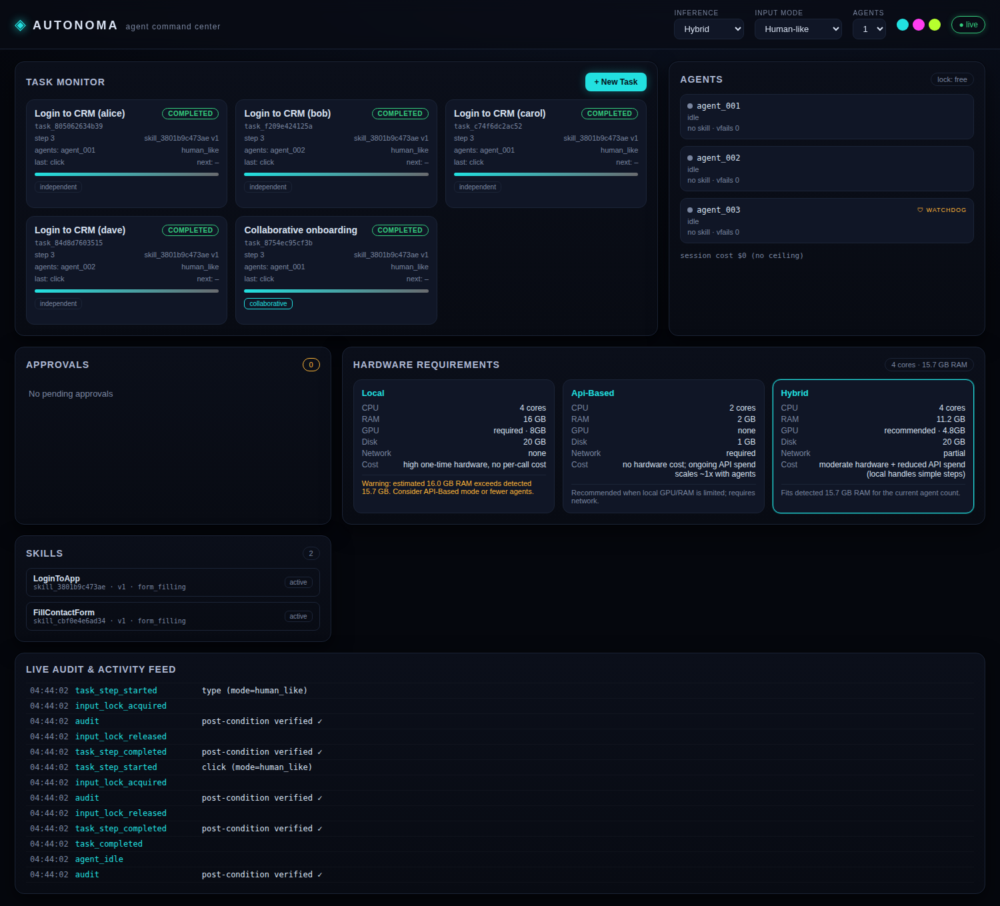

# Autonoma — Manus-Style AI Agent System

Autonoma is an original, production-oriented multi-agent **desktop & workflow
automation command center**. It implements the general concepts of a Manus-style
system — multi-agent task execution, desktop automation, a skills framework,
API control, real-time task visualization, safety controls, and audit logging —
as an independent codebase.

> **Original work.** Autonoma does not copy any proprietary software, branding,
> UI, source code, private APIs, or protected workflows. It is intended for
> **personal, authorized use only** — automating your own accounts, devices, and
> workflows. It is explicitly **not** built to evade anti-bot systems, CAPTCHAs,
> fraud/abuse detection, rate limits, or terms-of-service restrictions. The
> approval gates and safety boundaries in this system are required behavior, not
> optional. See [`docs/SAFETY.md`](docs/SAFETY.md).



---

## Highlights

| Area | What you get |
|---|---|
| **Agent orchestration** | 1–3 concurrent agents, Independent or Collaborative mode, worker/watchdog roles, shared input lock, sequential approval queue, session cost ceiling, stuck/drift detection & recovery |
| **Desktop automation** | OS-abstracted backend (Windows/macOS/Linux), human-like *and* machine-speed input modes, post-action verification, bounded click retry-with-recheck, zoom/region re-capture, OS-command compatibility validation. Safe **simulated backend** by default; opt-in real `pyautogui` backend |
| **Skills** | Versioned, immutable, JSON-Schema-validated skills; rollback/archive; live registry validation of every skill/action call; programming-by-demonstration (default 3 recordings) |
| **Inference modes** | Local / API-Based / Hybrid with a dynamic hardware-requirements comparison panel; provider endpoint constrained to plain chat/multimodal completions (no provider agent/computer-use endpoints) |
| **Live monitoring** | WebSocket + SSE event streams, real-time task cards, agent feed, approval overlays, actively-probed health (no stale flags) |
| **Safety & audit** | Approval gating for 13 high-risk action classes, append-only redacted audit trail with truthful `verified`/`status` coupling |
| **Secrets** | Encrypted local vault, reference-only handles (`password_secret_ref`), redaction across UI/API/streams/logs/screenshots |
| **Deploy** | Dockerfile + docker-compose, `.env.example`, example skills/tasks, tests |

---

## Architecture

```
                         ┌─────────────────────────────────────────┐
   Browser (dashboard    │              FastAPI backend            │
   or React SPA) ──WS/SSE┤  /api/v1/{tasks,agents,skills,          │
                         │           inference-mode,monitor,...}   │
                         │                                          │
                         │  Orchestration engine                   │
                         │   ├─ scheduler → worker agents (1–3)     │
                         │   ├─ shared InputLock (one cursor)       │
                         │   ├─ sequential ApprovalQueue            │
                         │   ├─ CostCeiling                         │
                         │   └─ stuck/drift monitor + watchdog      │
                         │                                          │
                         │  Skills registry (versioned, validated)  │
                         │  Automation backend  ── simulated | desktop
                         │   ├─ behavior modes (human-like/machine) │
                         │   ├─ post-action verification            │
                         │   └─ OS-command compatibility check      │
                         │                                          │
                         │  Secret vault · Append-only audit · Bus  │
                         │  SQLite persistence                      │
                         └─────────────────────────────────────────┘
```

Full write-up: [`docs/ARCHITECTURE.md`](docs/ARCHITECTURE.md).

---

## Quickstart (local, no Docker)

```bash
cd autonoma/backend
python -m venv .venv && source .venv/bin/activate
pip install -r requirements.txt
uvicorn app.main:app --reload --port 8000
```

Open **http://127.0.0.1:8000/** for the dashboard. Then seed example data:

```bash
BASE=http://127.0.0.1:8000 ./examples/seed.sh
```

This creates two skills, stores a demo secret (returns a reference, never the
value), and starts a login task. The login task **pauses for approval** at the
`login_submit` step — approve it from the dashboard to continue.

## Quickstart (Docker)

```bash
cd autonoma
cp .env.example .env          # optionally set AUTONOMA_VAULT_KEY
docker compose up --build
```

App on **http://localhost:8000/**. Data persists in the `autonoma-data` volume.

More detail: [`docs/QUICKSTART.md`](docs/QUICKSTART.md) · [`docs/SETUP.md`](docs/SETUP.md).

---

## The two frontends

- **Zero-build dashboard** (default): a polished dark-neon command center served
  by the backend at `/`. No Node, no build step — works immediately, including in
  Docker. Lives in `backend/app/static/`.
- **React SPA** (optional): a Vite + React app in `frontend/` for teams that want
  a component-based build. `npm run build` outputs to `dist/`; the backend serves
  it automatically when present at `backend/app/static/dist/`.

Both talk to the same API and support the required neon accents (cyan / magenta / lime).

---

## Inference modes & hardware

Choose where **model inference** runs (distinct from where the app is deployed):

- **Local** — models run on your hardware, no external inference calls.
- **API-Based** — inference via an external provider (OpenRouter/OpenAI/Anthropic/…),
  **multimodal/vision required** so the automation layer can read screenshots.
- **Hybrid** — local for simple steps, API for complex reasoning (configurable routing).

The dashboard's **Hardware Requirements** panel compares CPU/RAM/GPU/VRAM/disk/
network/cost/latency for all three modes, scaled by active agent count, and warns
(non-blocking) when local hardware looks insufficient.

**Provider endpoint constraint:** only plain `chat_completion` / `multimodal_completion`
endpoints are allowed. A provider's own autonomous agent / tool-use / "computer use"
endpoint is rejected in config, because it would create a second, uncoordinated
control loop that bypasses Autonoma's input lock, approval queue, and audit trail.
The model may *see and reason about* the screen; only Autonoma's agent system *acts*.

---

## Testing

```bash
cd autonoma/backend
pip install -r requirements.txt pytest
pytest
```

The suite covers skills versioning/validation, task execution end-to-end, the
approval gate, secret redaction, inference-mode endpoint constraints, agent
config/watchdog, active health checks, and OS-command validation.

---

## API surface

Base paths: `/api/v1/tasks`, `/api/v1/agents`, `/api/v1/skills`,
`/api/v1/inference-mode`, `/api/v1/monitor`, plus `/api/v1/approvals`,
`/api/v1/secrets`, `/api/v1/session`. Interactive docs at `/docs`.
Full reference with example calls: [`docs/API.md`](docs/API.md).

---

## Project layout

```
autonoma/
├── backend/
│   ├── app/
│   │   ├── api/          # FastAPI routers (tasks, agents, skills, inference, monitor, safety)
│   │   ├── automation/   # OS abstraction, behavior modes, verification, oscompat, simulated/desktop backends
│   │   ├── core/         # orchestrator, agents, tasks, skills, inference, hardware, safety, approvals, health, demonstrations
│   │   ├── static/       # zero-build dashboard
│   │   ├── config.py  database.py  events.py  secrets_vault.py  audit.py  main.py
│   └── tests/
├── frontend/             # optional Vite + React SPA
├── examples/             # example skills, task, seed script
├── docs/                 # setup, API, safety, architecture, quickstart
├── Dockerfile  docker-compose.yml  .env.example
```

## License

MIT (this subproject). See repository root for details.
